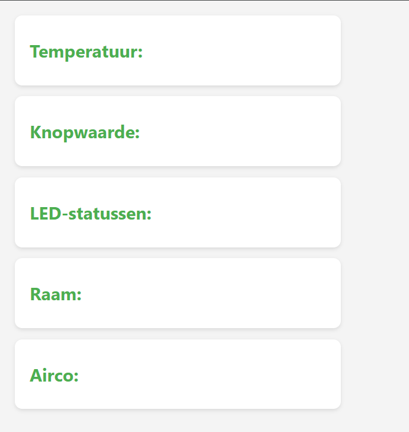

# Slimme Airco Controller met Webvisualisatie 

Dit Arduino-project stuurt een airco aan op basis van temperatuur en gebruikersinput via een drukknop. Daarnaast worden de status van de airco, het raam, en de LEDs doorgestuurd naar **JsonBin.io** en visueel weergegeven op een eenvoudige website gehost op github zelf.

## 📦 Inhoud

- `actuator.h / actuator.cpp` – stuurt een airco/motor aan en 3 status-LEDs (groen, rood, blauw)
- `sensor.h / sensor.cpp` – leest een temperatuursensor en een drukknop uit
- `JSONAPI.h / JSONAPI.cpp` – stuurt data naar JsonBin.io via WiFi
- `index.html / styles.css` – toont de data van de airco, temperatuur, drukknop en LED-status op een overzichtelijke webpagina
-  `main.cpp` – Linkt alle headers en cpp files samen tot een werkende Airco Controller


---

## 🔧 Hardwarebenodigdheden

| Onderdeel           | Aantal | Beschrijving                                         |
|---------------------|--------|------------------------------------------------------|
| ESP32               | 1      | Om alles te schakelen                                |
| Temperatuursensor   | 1      | AHT20 Temperatuursensor, kan temp en vocht uitlezen  |
| Drukknop            | 1      | Simuleert 'raam open/toe'                            |
| LEDs                | 3      | Groen (aan), Rood (uit), Blauw (waarschuwing)        |
| Weerstanden         | 4(220Ω)| Voor de LEDs + Transistor                            |
| Motor of Airco-actor| 1      | Wordt gestuurd op basis van temperatuur              |
| WiFi-netwerk        | 1      | Om data te versturen naar JsonBin.io                 |
| Transistor (NPN)    | 1      | Motor aansturen                                      |
| Breadboard          | 2      | Om schakeling te maken                               |
| Propellor           | 1      | Om de Airco te simuleren                             |
| Jumper wires        | 10+    | Voor het maken van verbindingen op het breadboard     |
| Externe Voeding        | 1    | Om de Motor de voeden     |


---

## ⚙️ Software Setup

1. **Libraries**:
   - Arduino standaardbibliotheek
   - WiFi (ESP32 of ESP8266 afhankelijk van je board)
   - ArduinoJSON (indien gewenst voor betere JSON-opbouw)
   - AHT20 voor de temperatuursensor

2. **JsonBin.io setup**:
   - Maak een account op [jsonbin.io](https://jsonbin.io)
   - Maak een nieuwe bin aan
   - Noteer jouw **bin ID** en **X-Master-Key**

3. **Code aanpassen**:
   In `main.cpp`:
   ```cpp
   JsonbinSender sender("SSID", "Wachtwoord", "binId", "X-Master-Key");
   ```

---

## 📡 Functionaliteit

| Sensor/Actuator   | Functie |
|-------------------|---------|
| Temperatuursensor | Meet omgevingstemperatuur |
| Drukknop          | Simuleert of raam open/dicht is |
| LEDs              | Groen = airco aan, Rood = uit, Blauw = waarschuwing |
| Motor/Airco       | Wordt ingeschakeld als temperatuur ≥ 25 °C en raam is gesloten |
| WiFi              | Stuurt live gegevens naar JsonBin |
| Webpagina         | Toont temperatuur, knopstatus, raamstatus, aircostatus en LED-status |

---

## 🌐 Website (Frontend)

Bestand: `index.html`

Toont live status van het systeem via data die van JsonBin wordt opgehaald met JavaScript. De website vernieuwt elke 60 seconden automatisch. Je ziet onder andere:

- 🌡️ Temperatuur
- 🔘 Knopstatus
- 💡 LED-statussen (groen, rood, blauw)
- 🪟 Raamstatus
- ❄️ Airco aan/uit

---


## 📷 Screenshot (voorbeeld)

---

---

## 👨‍💻 Gemaakt door

Vitaly Minkov, Mauro Vanmaldeghem & Ocean Dekeyser – VTI Brugge, richting Applicatie- en Databeheer  
Schoolproject 2025
